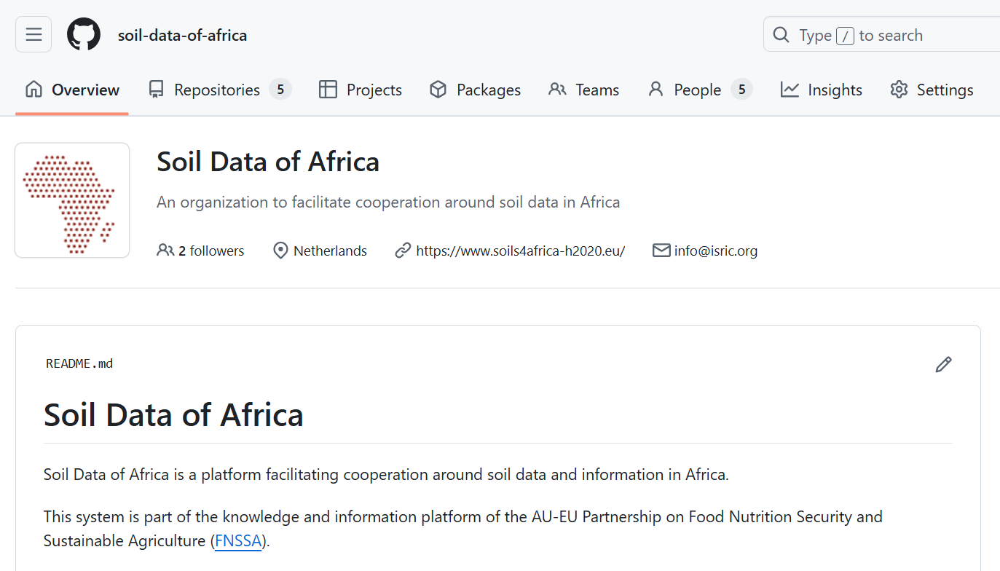
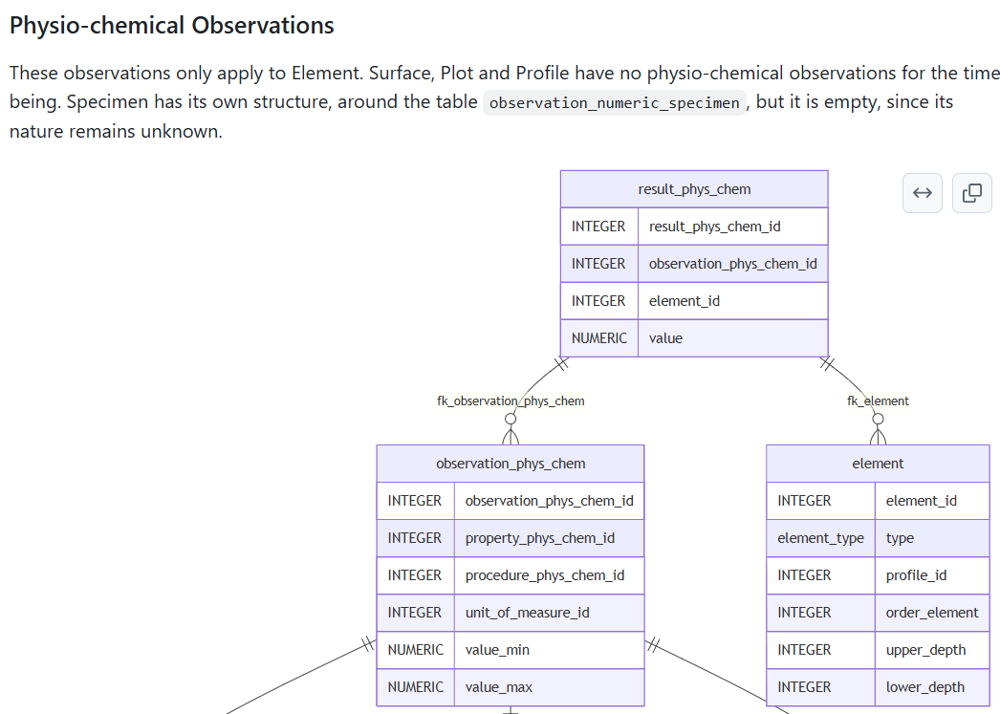
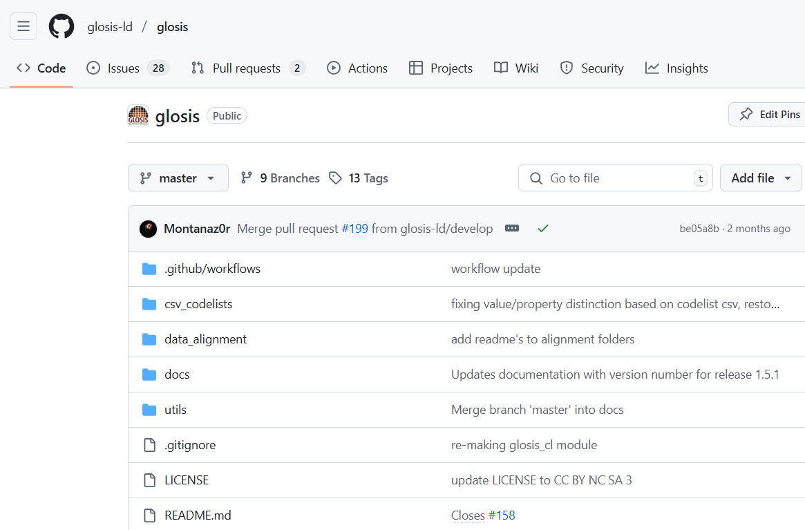

::: {.page-section section_name='intro' content_class='pt-0 pb-4'}
:::: {.grid}

::::: {.g-col-12}

:::::: {.lead .mb-0}
This page lists various code repositories, where tools are developed to facilitate the soil data domain, in a cooperative way. 

::::::

:::::

::::
:::

::: {.page-section section_name='repo-1' has_bg_color='secondary'}
:::: {.grid}

::::: {.g-col-12 .g-col-md-6}
## Soil data of Africa Github Organisation

The organisation hosts repositories related to various tools used in Soil data of Africa infrastructure.


:::::

::::: {.g-col-12 .g-col-md-6 .g-start-md-8}
:::::: {layout-ncol=1 .mt-5}
{fig-align="left"}
::::::
:::::

::::
:::

::: {.page-section section_name='repo-2'}
:::: {.grid}

::::: {.g-col-12 .g-col-md-6}
:::::: {layout-ncol=1 .mt-5}
{fig-align="left"}
::::::
:::::

::::: {.g-col-12 .g-col-md-6 .g-start-md-8}
## A PostGres implementation of the iso28258 concept model

This repository is used to maintain a common postgres implementation of the [ISO 28258:2013 concept model](https://www.iso.org/standard/44595.html). ISO 28258 describes a model to store soil observation and measurement data and is based on the Open Geospatial Consortium [Observations and Measurements](https://portal.ogc.org/files/?artifact_id=22466) standard.



:::::

::::
:::

::: {.page-section section_name='repo-3' has_bg_color='secondary'}
:::: {.grid}

::::: {.g-col-12 .g-col-md-6}
## GLOSIS LD

The [Global Soil Information system](https://www.fao.org/global-soil-partnership/areas-of-work/soil-information-and-data/en/) is an initiative of GSP/FAO. 
The GLOSIS Conceptual Domain Model, based on ISO 28258:2013 has been implemented in semantic web technology by the [SIEUSOIL](https://cordis.europa.eu/project/id/818346) project. This semantic model, called GLOSIS-LD, is further maintained by a group of soil experts in this github repository.


:::::

::::: {.g-col-12 .g-col-md-6 .g-start-md-8}
:::::: {layout-ncol=1 .mt-5}
{fig-align="left"}
::::::
:::::

::::
:::

