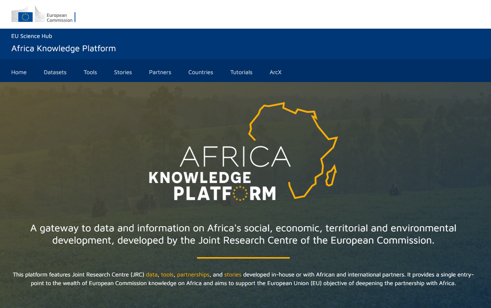
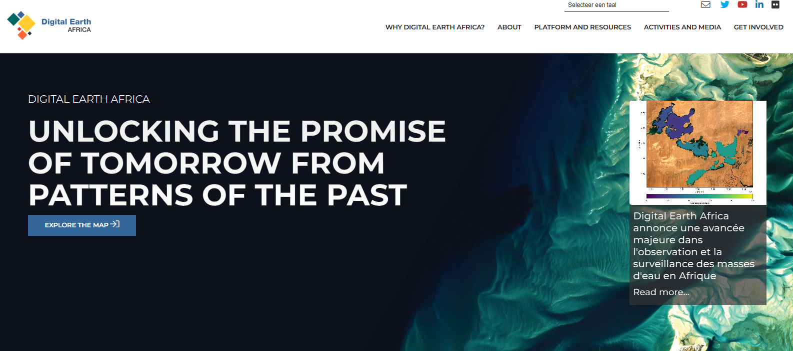
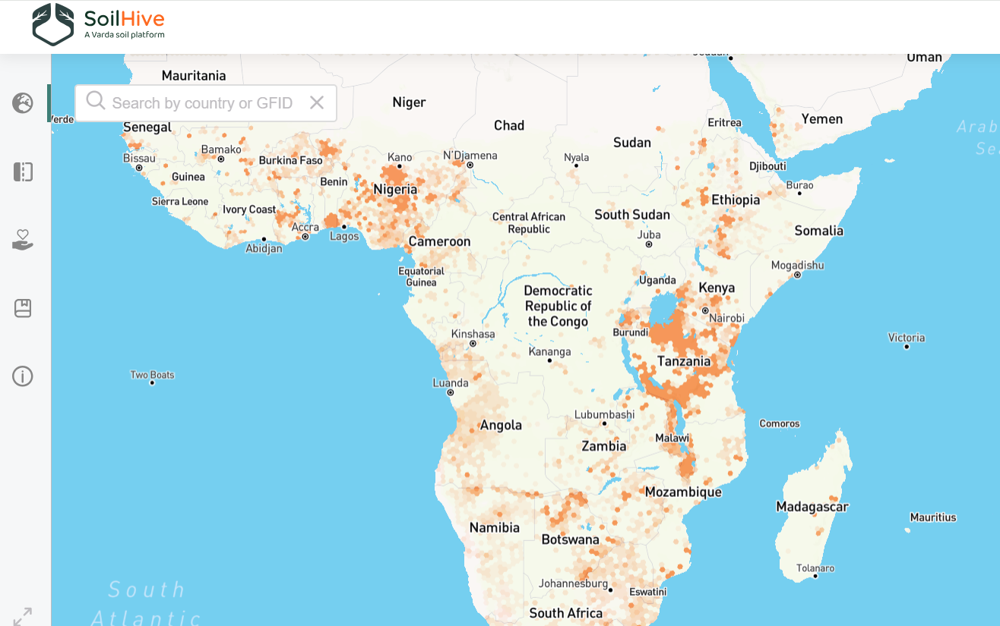
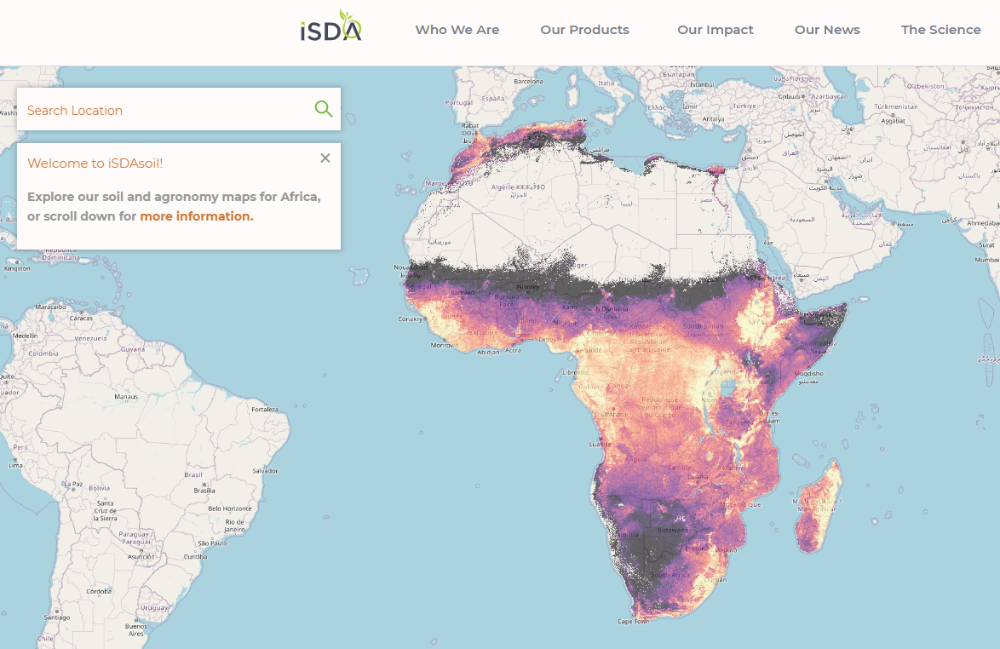
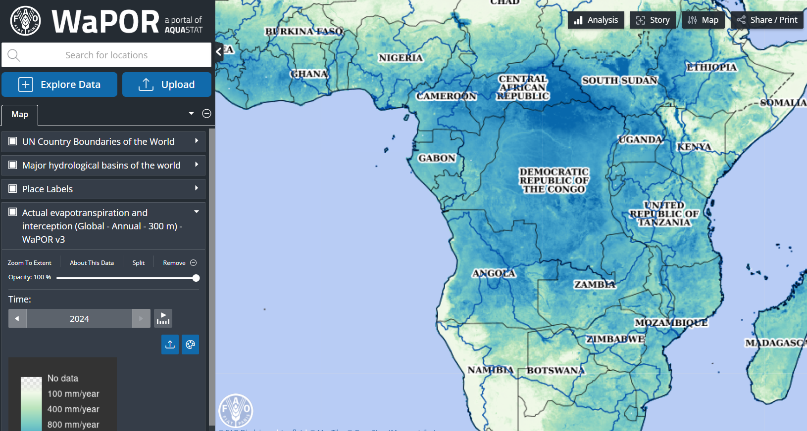
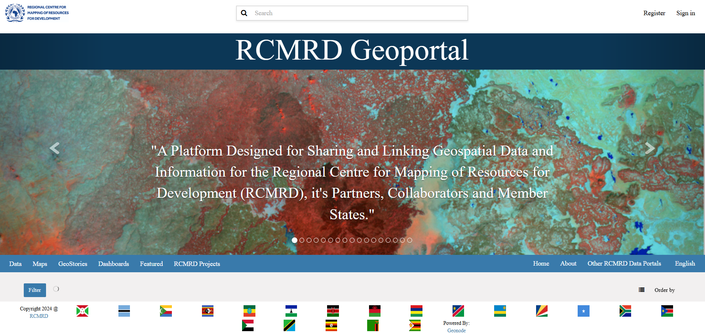
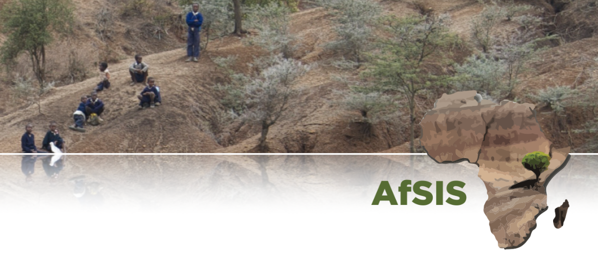
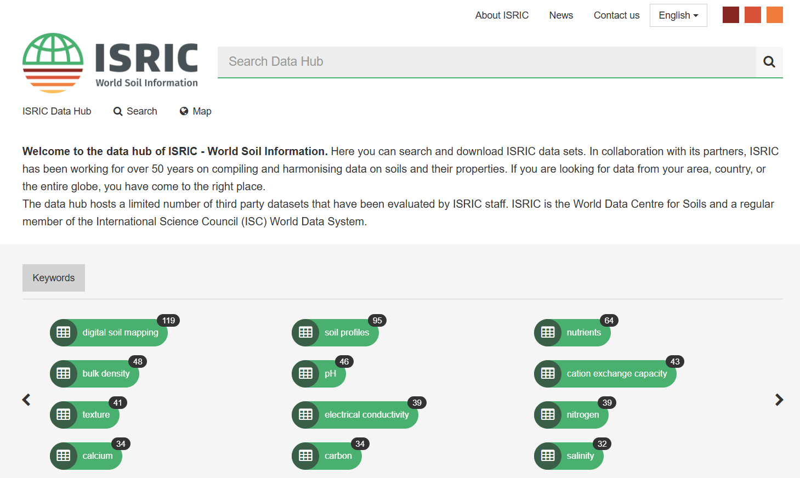

::: {.page-section section_name='intro' content_class='pt-0 pb-4'}
:::: {.grid}

::::: {.g-col-12}

:::::: {.lead .mb-0}
This page lists data platforms with a pan African focus
::::::

:::::

::::
:::

::: {.page-section section_name='platform-1' has_bg_color='secondary'}
:::: {.grid}

::::: {.g-col-12 .g-col-md-6}
## Africa Knowledge Platform

This platform features Joint Research Centre (JRC) data, tools, partnerships, and stories developed in-house or with African and international partners. It provides a single entry-point to the wealth of European Commission knowledge on Africa and aims to support the European Union (EU) objective of deepening the partnership with Africa.


:::::

::::: {.g-col-12 .g-col-md-6 .g-start-md-8}
:::::: {layout-ncol=1 .mt-5}
{fig-align="left"}
::::::
:::::

::::
:::

::: {.page-section section_name='platform-2'}
:::: {.grid}

::::: {.g-col-12 .g-col-md-6}
:::::: {layout-ncol=1 .mt-5}
{fig-align="left"}
::::::
:::::

::::: {.g-col-12 .g-col-md-6 .g-start-md-8}
## Digital Earth Africa

DE Africa will provide a routine, reliable and operational service, using Earth observations to deliver decision-ready products enabling policy makers, scientists, the private sector and civil society to address social, environmental and economic changes on the continent and develop an ecosystem for innovation across sectors.


:::::

::::
:::

::: {.page-section section_name='platform-1' has_bg_color='secondary'}
:::: {.grid}

::::: {.g-col-12 .g-col-md-6}
## Soilhive

A digital tool to catalyze collaboration within the Food & Ag industry ​and enable the expansion of soil data availability


:::::

::::: {.g-col-12 .g-col-md-6 .g-start-md-8}
:::::: {layout-ncol=1 .mt-5}
{fig-align="left"}
::::::
:::::

::::
:::

::: {.page-section section_name='platform-2'}
:::: {.grid}

::::: {.g-col-12 .g-col-md-6}
:::::: {layout-ncol=1 .mt-5}
{fig-align="left"}
::::::
:::::

::::: {.g-col-12 .g-col-md-6 .g-start-md-8}
## iSDASoil

A field-level soil map for Africa, with 20+ soil properties predicted at 30m resolution for the entire continent.


:::::

::::
:::

::: {.page-section section_name='platform-1' has_bg_color='secondary'}
:::: {.grid}

::::: {.g-col-12 .g-col-md-6}
## FAO WAPOR

Remote sensing for water and land productivity (WaPOR) is FAO’s portal to monitor Water Productivity through Open access of Remotely sensed derived data. The WaPOR project aims to assist partner countries in developing their capacity to monitor and improve water and land productivity in agriculture, both rainfed and irrigated, responding therefore to the challenges that are posed by the dwindling of freshwater resources and the need to sustain agri­cultural production to ensure food security in the face of a changing climate.

The first output of the project is the WaPOR database and portal, which provides open access to near-real time information on key land and water variables.


:::::

::::: {.g-col-12 .g-col-md-6 .g-start-md-8}
:::::: {layout-ncol=1 .mt-5}
{fig-align="left"}
::::::
:::::

::::
:::

::: {.page-section section_name='platform-2'}
:::: {.grid}

::::: {.g-col-12 .g-col-md-6}
:::::: {layout-ncol=1 .mt-5}
{fig-align="left"}
::::::
:::::

::::: {.g-col-12 .g-col-md-6 .g-start-md-8}
## RCMRD Geoportal

A Platform Designed for Sharing and Linking Geospatial Data and Information for the Regional Centre for Mapping of Resources for Development (RCMRD), it's Partners, Collaborators and Member States.


:::::

::::
:::

::: {.page-section section_name='platform-1' has_bg_color='secondary'}
:::: {.grid}

::::: {.g-col-12 .g-col-md-6}
## Africa Soils (AfSIS)

AfSIS aims to empower governmental bodies, NGOs, and private sector organizations working in Africa with precise LULC and environmental mapping and monitoring solutions, fostering sustainable land, soil, and environmental management practices. Through expert analysis, innovative software, and targeted training, we aim to facilitate informed decision-making, promote resilient agricultural and rangeland management, and support the sustainable expansion of croplands and energy infrastructure. Committed to advancing soil health and combating the challenges of urbanization, AfSIS is dedicated to guiding our clients towards evidence-based, sustainable development and environmental stewardship.


:::::

::::: {.g-col-12 .g-col-md-6 .g-start-md-8}
:::::: {layout-ncol=1 .mt-5}
{fig-align="left"}
::::::
:::::

::::
:::

::: {.page-section section_name='platform-2'}
:::: {.grid}

::::: {.g-col-12 .g-col-md-6}
:::::: {layout-ncol=1 .mt-5}
{fig-align="left"}
::::::
:::::

::::: {.g-col-12 .g-col-md-6 .g-start-md-8}
## ISRIC Datahub

ISRIC–World Soil Information is an independent science-based foundation with a mission to serve the international community as a custodian of global soil information. We support the development and use of soil information to address global challenges through capacity strengthening, awareness raising and direct cooperation with users and clients. 


:::::

::::
:::
