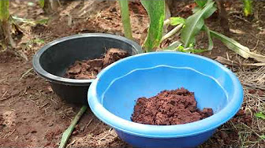
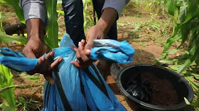
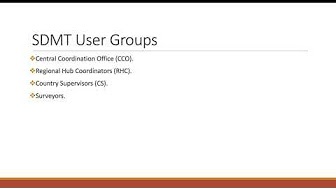
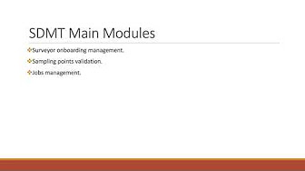
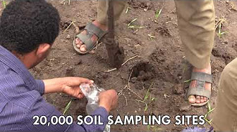

The [Soils for Africa](https://www.soils4africa-h2020.eu/images-videos) project produced a series of videos, published on YouTube, on various topics including guides and protocols for field survey and field survey management in different languages. A selection of these videos can be accessed from this page. For an overview of all videos, visit the [Soils4Africa YouTube channel](https://www.youtube.com/@soils4africa373/videos).

## Soils4Africa Field Protocol

This playlist contains ten videos documenting the field protocols for soil sampling and observations, which guided the fieldwork in the Soils4Africa project. Videos are available in English, French and Arabic.

::: {layout-ncol=3}
[{fig-align="left"}](https://www.youtube.com/playlist?list=PLB4Kg_AOaGwGLT9iY77wgm_CMNTA3xtvA)

[{fig-align="left"}](https://www.youtube.com/playlist?list=PLB4Kg_AOaGwHGHRSqTM-sPKboSpk6wLjK)

[{fig-align="left"}](https://www.youtube.com/playlist?list=PLB4Kg_AOaGwF5Qcf4D8zZx3zA3pePramw)
:::

## Survey Data Management Tool

This playlist contains of five videos that the functionality of the ‘Survey Data Management Tool’ that was developed by the Soils4Africa project to manage the field survey. Videos are available in English, French and Arabic.

::: {layout-ncol=3}
[{fig-align="left"}](https://www.youtube.com/playlist?list=PLB4Kg_AOaGwHrbAW61xgxImg_OulZshyN)

[{fig-align="left"}](https://www.youtube.com/playlist?list=PLB4Kg_AOaGwFv-VfC_AYm3ETRP2AgTb_q)

[{fig-align="left"}](https://www.youtube.com/playlist?list=PLB4Kg_AOaGwGML992CJj_KyWC3iBDy8y1)
:::

## Soils4Africa: Introduction

This playlist contains three videos which introduce the Soils4Africa project. The videos are available in English only. 

[{fig-align="left"}](https://www.youtube.com/playlist?list=PLB4Kg_AOaGwHbfvwuexeWN5kqTJgG_WLX)

